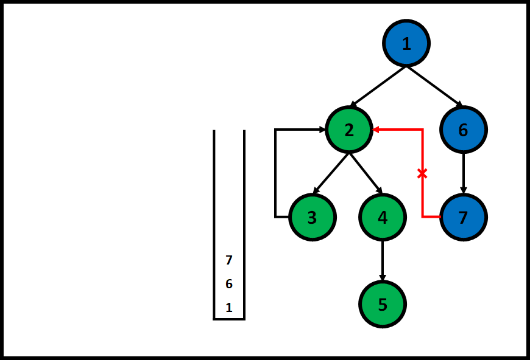

## 名詞解釋
* Connected 連通: Graph中頂點(Vertice)a跟頂點有路可通,則兩點連通
* Strongly Connected 強連通: 在有向圖中,兩點之間雙向皆有路可通，為強連通
* Weakly Connected 弱連通: 在有向圖中,至少單向有路可通，為弱連通
* Strongly Connected Component: 某區塊中所有點都互為強連通, 且區塊外沒有沒有其它點跟該區塊內的點為強連通, 該區塊為Strongly Connected Component

## 演算法
### Tarjan's Algorithm

用DFS遍歷整張圖,進入點後將點加入Stack
陣列Visit紀錄該點進入DFS的順序
陣列Low紀錄該點能觸及到順序最前的點
陣列SCC紀錄該點所屬的SCC


當某點Low等於Visit時
代表該點為SCC的最上層(如上圖的點2、點1)
此時Stack中該點之前的所有點(2,3,4,5)屬於同一個SCC


計算某點的Low是從所有該點為起點的邊中尋找終點Visit的最小值
其中比較特別的情況是如果終點不在同一個SCC就不能計算進去
如圖的點2跟點7為不同SCC,這條邊就該略過
要避免的最好方法就是判斷該終點有沒有在Stack中
用ArrayList的contain method每次都要花費O(n)的時間
比較好的方法是新增boolean陣列inStack在放入跟取出Stack時紀錄
DFS進去點時設為true, 設定完SCC後再設為false

### Kosaraju's Algorithm
速度沒Tarjan快還要做Graph的transpose,有機會再細講
主要觀念是利用"一個圖的反向圖和原圖具有一樣的SCC"
是先做一次DFS紀錄Reverse PostOrder
在根據紀錄的Order的倒序做DFS, 每次DFS都會是得到一個SCC

### Gabow's algorithm
比較少用到, 有時間一定補, 就是這麼任性

## 題型
### 從Graph中找出Strongly Connected Component
[UVa 247 - Calling Circles **](https://uva.onlinejudge.org/index.php?option=com_onlinejudge&Itemid=8&category=24&page=show_problem&problem=183)
>電話公司要算出通話的小圈圈, 其實就是找出SCC, 然後輸出

``` 
private static List<List<Integer>> calls = new ArrayList <>();

private static List<List<Integer>> circles = new ArrayList <>();

private static Map<String, Integer> numMap = new HashMap <>();

private static Map<Integer, String> nameMap = new HashMap <>();

private static int depth;

public static void main(String[] args) throws IOException {
 BufferedReader br = new BufferedReader(new InputStreamReader(System.in));
 StringBuilder sb = new StringBuilder();
 String str;
 int caseIndex = 1;
 while (!(str = br.readLine()).equals("0 0")) {
  String[] line = str.split(" ");
  int personNum = Integer.parseInt(line[0]);
  int callNum = Integer.parseInt(line[1]);
  initial(personNum);
  for (int i = 0, index = 0; i < callNum; i++) {
   line = br.readLine().split(" ");
   index = putInMap(line[0], index);
   index = putInMap(line[1], index);

   List<Integer> caller = calls.get(numMap.get(line[0]));
   int callee = numMap.get(line[1]);
   if (!caller.contains(callee)) {
    caller.add(callee);
   }
  }
  int[] visit = new int[personNum];
  int[] low = new int[personNum];
  boolean[] instack = new boolean[personNum];
  Stack<Integer> stack = new Stack <>();
  for (int i = 0; i < personNum; i++) {
   if (visit[i] == 0) {
    tarjan(i, visit, low, instack, stack);
   }
  }
  if (caseIndex != 1) {
   sb.append("\n");
  }
  sb.append("Calling circles for data set " + caseIndex++ + ":\n");
  sb.append(printCircles());
 }
 System.out.print(sb);
}

private static void tarjan(int now, int[] visit, int[] low
boolean[] instack, Stack<Integer> stack) {
 visit[now] = low[now] = ++depth;
 instack[now] = true;
 stack.push(now);
 for (int i: calls.get(now)) {
  if (visit[i] == 0) {
   tarjan(i, visit, low, instack, stack);
   low[now] = Math.min(low[now], low[i]);
  } else if (instack[i]) {
   low[now] = Math.min(low[now], visit[i]);
  }
 }
 if (low[now] == visit[now]) {
  int num;
  List<Integer> circle = new ArrayList <>();
  do {
   num = stack.pop();
   instack[num] = false;
   circle.add(num);
  } while (num != now);
  circles.add(circle);
 }
}

private static String printCircles() {
 StringBuilder sb = new StringBuilder();
 for (List<Integer> circle: circles) {
  for (int i = 0; i < circle.size(); i++) {
   String name = nameMap.get(circle.get(i));
   if (Objects.isNull(name)) {
    name = "";
   }
   if (i == 0) {
    sb.append(name);
   } else {
    sb.append(", " + name);
   }
  }
  sb.append("\n");
 }
 return sb.toString();
}

private static int putInMap(String name, int index) {
 if (!numMap.containsKey(name)) {
  numMap.put(name, index);
  nameMap.put(index, name);
  index++;
 }
 return index;
}

private static void initial(int personNum) {
 nameMap.clear();
 numMap.clear();
 circles.clear();
 calls.clear();
 depth = 0;
 for (int i = 0; i < personNum; i++) {
  calls.add(new ArrayList <>());
 }
}
```

[UVa 11838 - Come and Go ***](https://uva.onlinejudge.org/index.php?option=com_onlinejudge&Itemid=8&category=24&page=show_problem&problem=2938)

>某城市的路口是由多條單向或雙向道交接而成, 要判斷所有路口是否都相通
> 用Tarjan's Algorithm算出SCC, Check是不是所有點都在通一個SCC

``` 
private static int index;

private static int connectNum;

private static int[][] graph;

private static int[] visit;

private static int[] low;

private static int[] connect;

private static boolean[] inStack;

private static Stack<Integer> stack;

public static void main(String[] args) throws IOException {
 BufferedReader br = new BufferedReader(new InputStreamReader(System.in));
 StringBuilder sb = new StringBuilder();
 while (true) {
  String[] line = br.readLine().split("\\s+");
  int pointNum = Integer.parseInt(line[0]);
  int streetNum = Integer.parseInt(line[1]);
  if (pointNum == 0 && streetNum == 0) {
   break;
  }
  inital(pointNum);
  while (streetNum--> 0) {
   line = br.readLine().split("\\s+");
   int point1 = Integer.parseInt(line[0]) - 1;
   int point2 = Integer.parseInt(line[1]) - 1;
   int direct = Integer.parseInt(line[2]);
   graph[point1][point2] = 1;
   if (direct == 2) {
    graph[point2][point1] = 1;
   }
  }

  tarjan(0);
  int isSCC = 1;
  for (int i: connect) {
   if (i != 0) {
    isSCC = 0;
    break;
   }
  }
  sb.append(isSCC + "\n");
 }
 System.out.print(sb);
}

private static void tarjan(int now) {
 visit[now] = low[now] = index++;
 inStack[now] = true;
 stack.push(now);

 for (int i = 0; i < visit.length; i++) {
  if (graph[now][i] == 1) {
   if (visit[i] == 0) {
    tarjan(i);
    low[now] = Math.min(low[now], low[i]);
   } else if (inStack[i]) {
    low[now] = Math.min(low[now], visit[i]);
   }
  }
 }
 if (low[now] == visit[now]) {
  int num;
  do {
   num = stack.pop();
   inStack[num] = false;
   connect[num] = connectNum;
  } while (num != now);
  connectNum++;
 }
}

private static void inital(int num) {

 connectNum = 0;
 index = 1;
 graph = new int[num][num];
 visit = new int[num];
 low = new int[num];
 connect = new int[num];
 Arrays.fill(connect, -1);
 inStack = new boolean[num];
 stack = new Stack <>();
}
```

[UVa 11504 - Dominos **](https://uva.onlinejudge.org/index.php?option=com_onlinejudge&Itemid=8&category=24&page=show_problem&problem=2499)
> 告訴多米諾骨牌中推倒某骨牌那些骨牌會跟著倒,要求最少要推倒幾個骨牌
> SCC中任意一個被推倒, 整個SCC內的骨牌都會倒, 可以想成每個SCC都是一個大骨牌
> 找到沒有被其他SCC指到的SCC的數量, 就是答案

```
Submit一直RTE, 懷疑是我用List<List>當圖的Adjacency List造成
先冰冰箱, 有機會再補
```